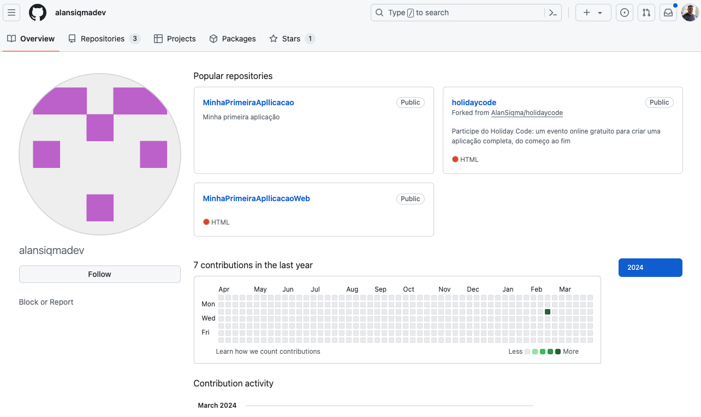

# Holiday Code 🥳🎉💃🕺👯👯‍♂️👯‍♀️
## O que é um Portfólio no GitHub?

No GitHub, um portfólio permite a organização do perfil e dos projetos de forma a projetar a imagem do indivíduo. É uma ferramenta valiosa para mostrar suas habilidades e experiências aos outros usuários da plataforma.

Um caso peculiar é que ao criar sua conta no GitHub, a página inicial do seu perfil exibe um layout padrão:

Após realizar as configurações padrões, é possível incrementar ainda mais a sua página. O GitHub oferece opções para personalizar seu perfil por meio de repositórios.

## Como fazer isso?

Ao criar um repositório com o nome do seu usuário, o GitHub projeta automaticamente o README deste repositório para sua página principal. Assim, todos que visitarem seu perfil visualizarão essa página modificada.

O README, neste contexto, é um arquivo de texto que geralmente acompanha um projeto de software ou repositório de código. Ele fornece informações essenciais sobre o projeto, como sua finalidade, instruções de instalação, configuração e uso, além de quaisquer outras informações relevantes que os usuários possam precisar.

No GitHub, o README de um repositório é exibido na página principal do repositório e pode ser personalizado pelos usuários para fornecer informações específicas sobre o projeto. Ele é escrito em formato de texto simples ou usando linguagens de marcação como Markdown, que permite adicionar formatação básica, como cabeçalhos, listas e links, tornando-o mais legível e organizado.

Assim, o README é uma parte fundamental da documentação do projeto e serve como um guia rápido para ajudar os usuários a entenderem o que é o projeto, como usá-lo e como contribuir para ele. Em muitos casos, o README é a primeira coisa que os usuários verão ao acessar um repositório, portanto, é importante que seja claro, conciso e informativo.

### Mãos à obra!

Vamos agora colocar isso em prática no seu repositório!
O seu perfil ficará semalhante a esse: 

